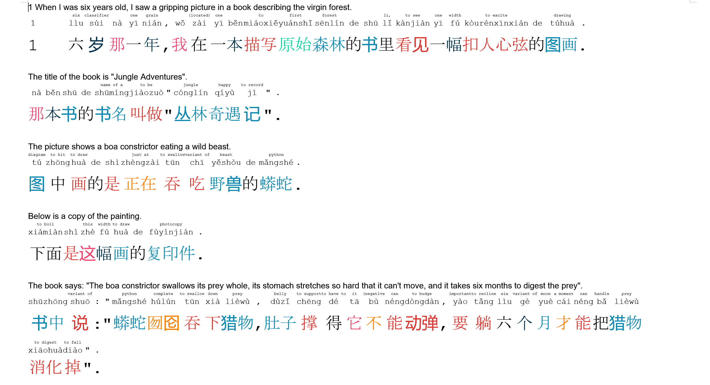

# Chinese Books


### Enrich Chinese texts

The goal of this script is to make learning Chinese easier by removing routine work like looking up words in a dictionary.
It takes a textfile with chinese content and outputs a microsoft word document with all the sentences translated, the corresponding pinyin and meanings above the chinese words. Groups of characters comprising a word are detected with a tokenizer, treated as a word and translated accordingly. the characters are color coded depending on the part of speech (noun, verb, adjective,...) and a hyperlink points to an online dictionary of the word for stroke order and more in depth translation

### Usage

Here is one example of how to use it for the input file `xiaowangzi.txt` and the output file `xiaowangzi.docx`:

```
python enrich.py xiaowangzi.txt outputs/xiaowangzi.docx
```

### Example

Here is an example of input and output:

Input: 


Output:

